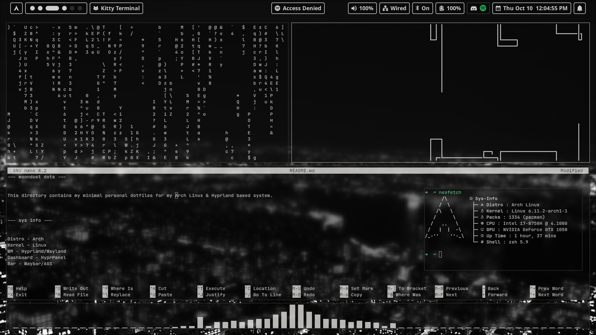

--- moondust dots ---

This directory contains my minimal personal dotfiles for my 
Arch Linux & Hyprland based system.

--- sys info ---

Distro - Arch
Kernel - Linux
WM - Hyprland/Wayland
Dashboard - HyprPanel
Bar - Waybar/AGS

--- dependencies ---

~ git
~ kitty
~ zsh
~ zsh-syntax-highlighting
~ hyprland
~ waybar
~ aylurs-gtk-widgets | AUR
~ cava
~ wlogout
~ rofi
~ hyprpanel
~ btop
~ hyprlock
~ neofetch
~ swww

